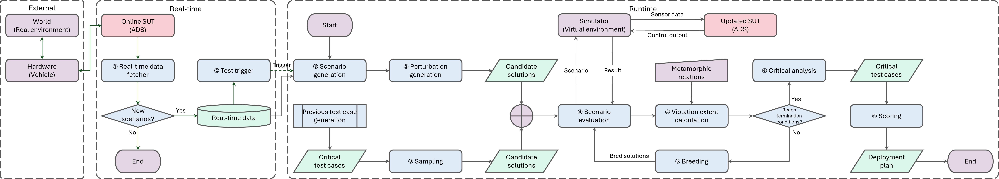

# CoCoMEGA

CoCoMEGA is a search-based framework for generating metamorphic test cases in autonomous driving. It combines
evolutionary algorithms with driving simulations (using CARLA and external driving agents like the InterFuser agent)
to find scenario variations that violate specified **Metamorphic Relations (MRs)**.

This is the replication package for the paper titled *Using Cooperative Co-evolutionary Search to Generate Metamorphic
Test Cases for Autonomous Driving Systems* by Hossein Yousefizadeh, Shenghui Gu, Lionel C. Briand, and Ali Nasr.

## Contents of this package

1. Implementation of CoCoMEGA, Standard Genetic Algorithm (SGA), and Random Search (RS).
2. Installation and usage guidelines.
3. An overview of the code structure.
4. An overview of configuration parameters.
5. Metamorphic relations involved.
6. The postprocess script used to answer the research questions, provided in `test/postprocess.ipynb`.
7. A copy of the evaluation results provided in `results.tar.gz`.

## Installation

### Prerequisites

- Python 3.7.
- Docker 24.0.7 or newer.
- NVIDIA driver 470.256 or newer.
- CUDA version 11.4 or newer.

### Steps

1. Setup CoCoMEGA

   ```shell
   git clone https://github.com/stkSGarcia/CoCoMEGA.git  # Skip this if you already have the source.
   cd CoCoMEGA
   python3.7 -m venv .venv
   source .venv/bin/activate
   ```

2. Install InterFuser

   ```shell
   cd ..
   git clone https://github.com/opendilab/InterFuser.git
   cd InterFuser
   pip install -r requirements.txt
   cd interfuser
   python setup.py develop
   ```

3. Download and setup CARLA 0.9.10.1

   ```shell
   cd ..
   mkdir carla
   cd carla
   wget https://carla-releases.s3.us-east-005.backblazeb2.com/Linux/CARLA_0.9.10.1.tar.gz
   tar -xf CARLA_0.9.10.1.tar.gz
   rm CARLA_0.9.10.1.tar.gz
   cd ..
   easy_install carla/PythonAPI/carla/dist/carla-0.9.10-py3.7-linux-x86_64.egg
   ```

4. Install CoCoMEGA requirements

   ```shell
   cd ../CoCoMEGA
   pip install -r requirements.txt
   ```

5. Download pretrained model

   The model can be downloaded at [here](http://43.159.60.142/s/p2CN) and needs to be moved
   to `conf`.

## Usage

1. Build docker image

   ```shell
   docker build -t [tag_name] .
   ```
   The `tag_name` should be consistent with that defined in the configuration file located in
   `simulation:docker:image` (default is `carla-0.9.10`).

2. Local configurations

   Customize your configurations by modifying the default `config.yaml` file located in the `conf` directory.
   Save the customized configuration file as `config.yaml` in your project's root directory.

3. Run algorithms (CoCoMEGA, SGA, RS)

   ```shell
   python -m impl search -a ['ccea' | 'ga' | 'rs']
   ```

4. Use `--help` for more options

   ```shell
   python -m impl --help
   ```

## Architecture Overview



Below is an overview of the code structure, showing its key modules:

```
-conf/
  - config.yaml
- impl/
  - __main__.py
  - config.py
  - problem.py
  - algorithm/
    - base.py
    - ccea.py
    - ga.py
    - rs.py
  - mr/
    - mr.py
    - predefined.py
  - scenario/
    - scenario_definition.py
    - simulation_runner.py
    - route_scenario.py
    - Interfuser_scenario_evaluator.py
    - interfuser_agent.py
  - utils/
    - carla_utils.py
    - docker_utils.py
    - trajectory.py
    - visualization.py
    - metrics.py
    - math_utils.py
```

### Core Components in `impl/`

- `__main__.py` – The entry point of the application. It defines the command-line interface (using `python -m impl`
  invocation) for running searches, etc. It parses arguments (e.g., selecting the algorithm or mode) and invokes the
  appropriate functions or classes (e.g., starting a search with a specified algorithm).
- `config.py` – Configuration management module. It loads settings from config YAML file (located in `conf/config.yaml`)
  and makes them available via a global CONFIG object. All other parts of the code use this for parameters like search
  budget, population sizes, scenario settings, file paths, Docker image configs, etc.
- `problem.py` (Steps ③ and ④) – Defines the optimization problem and integrates all components. This sets up the
  evolutionary
  framework: it registers genetic operators, and defines the fitness function. The `problem.py` ties together scenarios
  from `scenario/`, perturbations/MRs from `mr/`, and algorithms from `algorithm/`.
- `algorithm/` (Steps ⑤ and ⑥): Contains implementations of search algorithms used to generate diverse test cases.
- `mr/` (Steps ③, ④, and ⑤): Defines metamorphic relations and mechanisms to evaluate them.
- `scenario/` (Steps ③ and ⑤): Manages scenario definition, execution, and evaluation in simulation environments.
- `utils/`: Offers utility functions supporting simulation interaction, mathematical operations, and result
  visualization.

### Algorithm Module (`impl/algorithm/`)

The algorithm module contains implementations of the search strategies, including CoCoMEGA’s custom algorithm and
baseline methods:

- `base.py` – Defines `BaseAlgorithm`, an abstract base class that provides common functionality for all search
  algorithms (initialization, logging setup, result recording, etc.). It sets up the general solve loop structure and
  statistics gathering using DEAP tools.
- `ccea.py` – Implements the Cooperative Co-Evolutionary Algorithm (CCEA) that powers CoCoMEGA. This algorithm
  co-evolves two populations – one of base scenarios and one of perturbations – collaborating to find scenario
  combinations that maximize MR violations.
- `ga.py` – A Standard Genetic Algorithm implementation. It evolves a single population of complete solutions (each
  solution encoding a scenario and its perturbations together) using crossover and mutation. This serves as a baseline
  to compare against CoCoMEGA’s co-evolutionary approach.
- `rs.py` – A Random Search strategy. Instead of evolving populations, this method randomly samples scenarios and
  perturbations. It’s used as a simple baseline to assess the benefit of guided search.

### Metamorphic Relations Module (`impl/mr/`)

The `impl/mr/` module defines how metamorphic relations are represented and checked. This is central to encoding the
testing oracle for CoCoMEGA (what constitutes a failure or interesting finding in the autonomous driving context):

- `mr.py` – Defines core classes for metamorphic relations:
    - **Perturbation**: Represents a single modification to apply to a scenario (e.g., adding a pedestrian, changing
      weather conditions). It includes the category of the perturbation (what is being changed), the operation type (
      add, remove, replace), and the value or range of change.
    - **Relation**: An abstract base class for the expected output relation. Subclasses like **_Invariance_**, *
      *_Decreasing_**, and **_Increasing_** specify the type of effect we expect on a certain metric due to the
      perturbation (e.g., invariance means the metric should not change, decreasing means the metric value should go
      down).
    - **MR**: Represents a full Metamorphic Relation, which ties together one or more Perturbation instances with an
      expected output relation. For example, an MR might consist of a perturbation “add a pedestrian in path” and an
      expected relation “ego vehicle’s speed should decrease”.
    - **MRSet**: A collection of multiple MRs, which can be used together if needed (the framework can consider several
      MRs at once or switch between sets for different experiments). This module also provides methods to apply
      perturbations to a scenario and to evaluate whether an MR is violated by comparing simulation outcomes from the
      original and perturbed scenarios.
- `predefined.py` – Contains definitions of specific metamorphic relations used in the project, corresponding to the
  descriptions from the paper/experiments. It uses the classes from `impl/mr.py` to build concrete instances. For
  example, it defines MR1–MR13 as described in the documentation (such as “adding a pedestrian on the roadside should
  cause the ego vehicle to slow down”). Each MR is created by specifying the needed `PerturbationFactory` (a helper to
  generate perturbations of a certain type) and the expected relation (slow for speed decrease, steer_keep for steering
  invariance, etc.).

### Scenario Module (`impl/scenario/`)

The scenario module manages the generation, execution, and evaluation of driving scenarios in the CARLA simulator. It
interfaces with InterFuser agent to obtain the outcomes needed to evaluate MRs. Major components of this module include:

- `scenario_definition.py` – Defines the `ScenarioDefinition` class and related data structures that represent a driving
  scenario. A scenario includes the route (or road configuration), traffic actors (ego vehicle, other vehicles,
  pedestrians), environmental conditions (weather, brightness), and any specific parameters or positions. This file also
  provides methods to randomly generate scenarios within defined bounds (e.g., placing actors within certain regions)
  and to apply perturbations to create follow-up scenarios. It establishes how scenarios are represented as individuals
  for the search (including how to mutate them or measure distance between scenarios). Additionally, classes for
  different actor types (e.g., `Vehicle`, `Walker`) inherit from a base `Actor` class here, and a `Boundary` class is
  used to specify allowable ranges/regions for scenario elements.
- `scenario_manager.py` – Manages the execution lifecycle of scenarios, largely leveraging CARLA’s ScenarioRunner
  infrastructure. This component takes care of initializing the CARLA world, spawning actors, and ticking the
  simulation. It controls when a scenario starts and stops, monitors timeouts, and ensures the simulation runs safely. (
  This file is adapted from CARLA's built-in scenario management code and includes logic like handling the simulation
  clock (GameTime) and watch-dog timers to recover from stalls.)
- `simulation_runner.py` – Orchestrates the actual running of scenarios and collection of results for the search. It is
  responsible for launching simulations (potentially in separate processes or using Docker) and obtaining the outcome
  data needed to evaluate MRs. Key functionalities of simulation_runner include initializing the CARLA server, loading
  required maps, and parallelizing scenario executions.
- `Interfuser_scenario_evaluator.py` – This sets up the scenario evaluation environment. It loads a scenario, runs the
  Interfuser agent through the scenario, and tracks scenario data for later evaluation.
- `interfuser_agent.py` – Defines the integration for the InterFuser agent within the simulation. This includes loading
  the Interfuser model and initializing sensors. It wraps the agent so that it can take sensor data from CARLA and
  output driving controls.

## Configuration Parameters Overview

The project uses a structured configuration file (`conf/config.yaml`) to manage various aspects of the testing
framework. Below is a high-level overview of the key parameters and sections in the configuration file:

### General Settings

`debug`: Toggles debug mode (true or false).

### Workspace Directories (`workspace`)

Paths for saving different types of results and intermediate data:

`root`: Base directory (`out/`).

Subdirectories include:

- `log`: Log files.
- `test_result`: Results of executed tests.
- `checkpoint`: Checkpoints of each run.
- `solution`: Final solutions of the search.
- `visualization`: Generated visualizations.
- `sim_result`: Execution Results.

### Simulation Parameters (`simulation`)

Settings to control the simulation execution:

- `repo`: Path to the InterFuser repository.
- `parallel`: Parallelize simulation execution.
- `retry_times`: Number of retries if simulation execution failed.
- `display_agent`: Display Agent Interface.
- `scenario_duration`: Duration of each scenario in seconds.
- `measurement_interval`: Seconds between scenario data measurements.
- `frame_rate`: Number of frames (ticks) per second.
- `high_graphics`: Use Fidelity Mode with better visuals.
- `autopilot`: Enable autopilot for other vehicles.
- `disable_spectator`: Disable the simulation spectator for efficiency.
- `docker`: Docker configuration for CARLA.
    - `enabled`: Enable Docker usage.
    - `image`: Built docker image name.
    - `memory`: Dedicated memory size.
    - `shared_memory`: Shared memory size.
    - `instances`: Configuration of docker instances for CARLA (controls the extent of parallelization for scenario
      execution).

### Search Budget (`budget`)

Settings for the search budget:

- `max_sim`: Maximum number of simulations.
- `max_time`: Maximum execution time.
- `max_gen`: Maximum number of generations.

### Scenario Population (`scenario`)

Scenario population parameters for CCEA:

- `pop_size`: Scenario population size.
- `archive_size`: Scenario archive size.
- `leaderboard_pb`: Probability of generating leaderboard-type scenarios.
- `init_pb`: Probabilities of generating different types of actors within a scenario.
- `max_actors`: Maximum actors allowed for scenario initialization.
- `dist_scaling`: The distance between two categorical values.
- `tournament`: Tournament size for tournament selection.
- `cxpb`: Crossover rate.
- `mutpb`: Mutation rate.
- `mut_add`: The probability of adding an actor when mutating.
- `mut_del`: The probability of deleting an actor when mutating.

### Perturbation Population (`perturbation`)

Perturbation population parameters for CCEA:

- `pop_size`: Perturbation population size.
- `archive_size`: Perturbation archive size.
- `dist_scaling`: The distance between two categorical values.
- `tournament`: Tournament size for tournament selection.
- `cxpb`: Crossover rate.
- `mutpb`: Mutation rate.

### Violation Detection (`violation`)

Mechanisms for detecting violations of metamorphic relations:

- `strategy`: Matching strategy.
- `max_ego_distance`: Maximum distance in meters between ego-vehicle and object. Used for critical intervals.
- `dtw`: Enable DTW matching.
- `reevaluation`: Configuration of the re-evaluation mechanism to aggregate fitness values.

### Diversity Optimization (`opt`)

Configurations for diversity optimization and niching strategies:

- `niching`:
    - `strategy`: niching strategy. Options are fitness sharing `sharing`, fitness clearing `clearing`, or not using
      niching `None`.
    - `punishment`: Punishment factor for fitness sharing.
    - `scaling`: Scaling factor for fitness sharing.
    - `capacity`: Number of winners in a niche when using fitness clearing.
- `diversity`: Enable diversity optimization.

### Trajectory Generation (`trajectory`)

List of predefined trajectories.

### Boundary (`boundary`)

Parameter boundaries for scenario/perturbation generation.

### Blueprints (`blueprint`)

List of available actor blueprints and weathers to use.

## Metamorphic Relations

- MR1: If a pedestrian appears on the roadside, then the ego-vehicle should slow down.
- MR2: If the driving time changes into night, then the ego-vehicle should slow down.
- MR3: Adding a vehicle in the front of the ego vehicle, the speed of the ego vehicle should decrease in t1% to t2%.
- MR4: Adding a pedestrian in the front of the ego vehicle, the speed of the ego vehicle should decrease in t1% to t2%.
- MR5: Changing from sunny to rainy, the speed of the ego vehicle should decrease in t1% to t2%.
- MR6: The density of fog (light/heavy/dense/strong/extra strong fog) in a foggy driving scene will not affect the
  steering angle of the autonomous driving systems.
- MR7: No matter how the driving scenes are synthesized to cope with different weather conditions (sunny and rainy), the
  driving steering angle are expected to be consistent with those under the corresponding original driving scenes.
- MR8: In a given driving scenario where the ego vehicle detects a target obstacle and attempts to avoid a collision,
  the ego vehicle should keep the steering unchanged when the speed of the ego vehicle changes (increased or decreased
  by a certain
  factor).
- MR9: In a given driving scenario where the ego vehicle detects a target obstacle and attempts to avoid a collision,
  the ego vehicle should keep the steering unchanged when adjusting (i.e., scaled down or up) the size of the ego
  vehicle.
- MR10: In a given driving scenario where the ego vehicle detects a target obstacle and attempts to avoid a collision,
  the ego vehicle should keep the steering unchanged when adjusting (i.e., scaled down or up) the size of the target
  obstacle.
- MR11: In a given driving scenario where the ego vehicle detects a target obstacle and attempts to avoid a collision,
  the ego vehicle should keep the steering unchanged when changing the position of the ego vehicle.
- MR12: In a given driving scenario where the ego vehicle detects a target obstacle and attempts to avoid a collision,
  the ego vehicle should keep the steering unchanged when changing the speed of the target obstacle.
- MR13: In a given driving scenario where the ego vehicle detects a target obstacle and attempts to avoid a collision,
  the ego vehicle should keep the steering unchanged when adding additional actors.

## License

This project is licensed under the GPL-3.0 License - see the [LICENSE](LICENSE) file for details.
